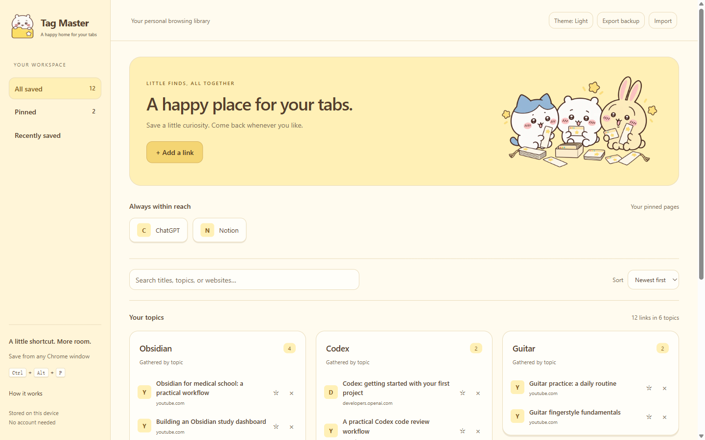

# Tag Master

A dependency-free Chrome Manifest V3 extension that saves selected pages to a persistent, automatically grouped library.



## Browser support

- Google Chrome 120 or newer on Windows, macOS, and Linux.
- Recent Chromium-based desktop browsers should also work. In Microsoft Edge, use `edge://extensions` instead of `chrome://extensions`.
- Firefox, Safari, Chrome for Android, and Chrome for iOS are not supported by this build.
- This repository is an unpacked development build. It is not currently a one-click Chrome Web Store install.

## Install from GitHub

1. On this GitHub page, click **Code**, then **Download ZIP**.
2. Extract the downloaded ZIP file. Do not select the ZIP itself in Chrome.
3. Open `chrome://extensions` in desktop Chrome.
4. Turn on **Developer mode** in the top-right corner.
5. Click **Load unpacked**.
6. Select the extracted `tag-master-main` folder—the folder that directly contains `manifest.json`.
7. Pin **Tag Master** in Chrome's extensions menu. Click its toolbar button to open the library.
8. If Chrome withholds site access, allow Tag Master on the pages where you want the shortcut to work, then refresh those pages.

Developers can instead clone the repository and load the cloned folder:

```text
git clone https://github.com/WeipingWu2023/tag-master.git
```

### Update an existing installation

Export a backup first. Download and extract the latest files, replace the contents of the existing extension folder without moving or renaming that folder, then click **Reload** on Tag Master at `chrome://extensions`. Keeping the same folder path helps Chrome preserve the unpacked extension identity and saved library. If Chrome requests site access after an update, allow it for the sites you want to save.

## Use

- Press **Ctrl + Alt + P** while focused on a webpage in **any Chrome window in the same profile** to save its current title, URL, description, and a short main-content excerpt. The library can be in another window or closed. A confirmation appears after storage succeeds. Focus inside an embedded webpage also works and saves the main tab, not the embedded frame.
- **Ctrl + Shift + P** is a registered browser-level fallback. Check conflicts or change it at `chrome://extensions/shortcuts`.
- Chrome forbids Ctrl+Alt in registered commands (AltGr conflicts), so that combination is implemented through a webpage key listener. It requires webpage focus; use the registered fallback when the address bar is focused. Chrome settings, the Chrome Web Store, built-in PDF viewers, and other protected pages cannot be captured. Add a link manually when capture is unavailable. Other browsers and separate Chrome profiles do not share this library.
- Click the extension toolbar button to open the library. Saving never closes a tab. Once a save is confirmed, you can close the original yourself.
- Hover or keyboard-focus a link to see its saved description or content excerpt. This is a text preview captured at save time, not a live embedded page or a complete offline copy.
- Use a star to pin favorites, **×** to delete, and **Undo** to restore the last deletion for 10 seconds.
- Click a topic title to rename it, use **+ New topic** to create an empty topic, and drag a saved link onto another topic card to move it. Click the small **×** on an empty topic to remove it. These choices survive restarts and are included in exported backups.
- Topics are discovered from repeated words in titles and descriptions, including languages supported by `Intl.Segmenter`. There is no predefined topic list, cloud AI service, or API key. This lexical method can miss synonyms and sometimes group pages around a broad word. Titles and descriptions carry more reliable signals than full article text.
- The Recent view shows the last seven days. Filtering does not alter saved records.

## Archive and privacy

Links are saved in `chrome.storage.local` and survive browser/computer restarts. Nothing expires. Clearing ordinary browsing history does not clear the library. Uninstalling the extension or deleting the Chrome profile removes it; **Export backup** creates a JSON archive and **Import** merges it without replacing existing records. Back up before moving computers or removing the extension. Storage is local, not account-synced.

The content script runs in HTTP/HTTPS pages and frames to detect the requested shortcut, but the background worker reads and stores main-page content only when you invoke capture. There is no automatic browsing-history collection, analytics, network classification, or third-party preview loading. Website host access enables the shortcut in existing tabs at installation/update/startup and captures the correct source tab across windows; storage is restricted to trusted extension contexts. Captured excerpts and exported backups may contain private page content.

## Theme and logo

The default light theme uses pale yellow and warm cream, with a cocoa-colored dark theme and an optional system setting. Existing theme preferences are preserved. Local Chiikawa artwork and a mascot logo are bundled with the extension, so they work offline. The library logo gently waves and sparkles; hover or keyboard-focus the brand to animate it again. Animation pauses while the page is hidden and is disabled by the system's reduced-motion preference. Chrome's toolbar uses matching PNG icons in 16, 32, 48, and 128-pixel sizes.

See [ASSETS.md](ASSETS.md) for generated artwork paths and prompts.

The bundled character images are unofficial, original fan-style illustrations created for this project. Chiikawa and its characters belong to their respective rights holders. This independent fan project is not affiliated with or endorsed by those rights holders.

## License

The source code is licensed under the [MIT License](LICENSE). The bundled Chiikawa-inspired artwork is a separate fan-style asset and remains subject to the artwork disclaimer above.

## Develop and verify

Requires Node.js 20+ for the development commands; Chrome needs no build step or runtime installation.

```text
npm test
npm run preview
```

Preview: `http://127.0.0.1:4173/library.html`. The web preview uses separate localStorage; the installed extension uses Chrome extension storage. Add `?demo=1` for a clearly labeled example collection. Demo controls cannot modify your real library; sample links do not navigate to invented videos.

Native CSS only animates transform/opacity for brief interaction feedback and respects reduced motion. No framework, animation dependency, remote fonts, or server is required by the extension.

`tests/extension-smoke.mjs` checks the real extension in an isolated temporary Chrome profile: two pre-existing browser windows, shortcut capture with focus inside an iframe, correct source-page identity, deduplication, pinning, delete/undo, and persistence after browser restart. Run the preview server first. It requires Playwright (set `PLAYWRIGHT_MODULE` to its `index.mjs` if it is not installed locally); optionally set `CHROME_BINARY` to a Chrome executable. The test uses Chrome's extension debugging API only in that temporary test browser.

References: https://developer.chrome.com/docs/extensions/reference/api/commands and https://developer.chrome.com/docs/extensions/reference/api/storage
